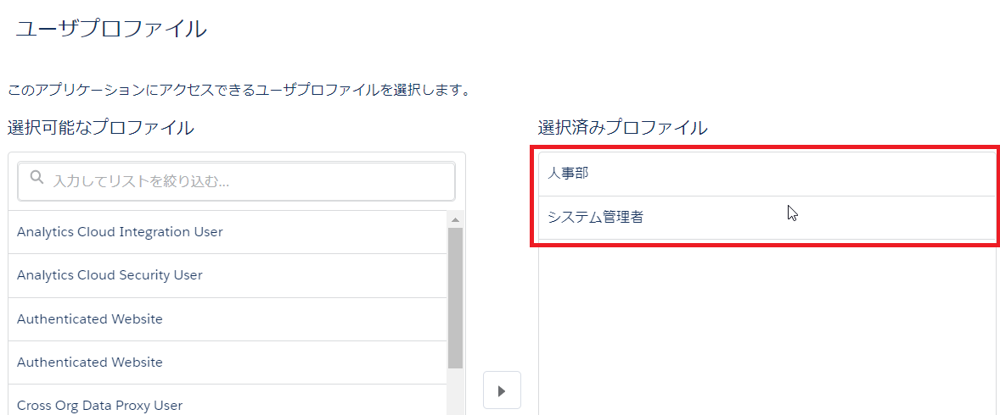

# Minihack Challenge 1 - Salesforce World Tour Tokyo 2019

## 解答例

### 要件3
任意のプロファイルをコピーして人事部プロファイルを作成します。

### 要件4
[Trail Tracker をインストール](https://login.salesforce.com/packagingSetupUI/ipLanding.app?apvId=04t1Q000000s2uCQAQ)します。

### 要件5
アプリケーションマネージャから人事部アプリケーションを作成します。

ユーティリティ項目は何でもOKです。

指定されたメニューをナビゲーション項目に含めます。

人事部プロファイルとシステム管理者プロファイルを選択します。

### 要件6
Lightning アプリケーションビルダーから新しいホームページを作成し、指定されたコンポーネントを配置します。レイアウトや配置順序は自由です。

保存後、人事部アプリケーションのデフォルトとして有効化してください。