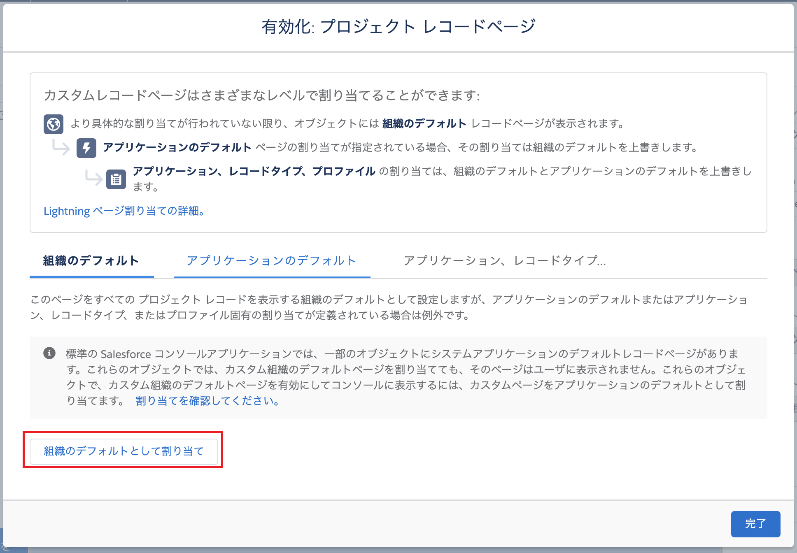

# Minihack Challenge 2 - Salesforce World Tour Tokyo 2019

* [画面から設定する](#解答例-画面から設定)
* [Salesforce CLIでサンプル解答をデプロイする](#解答例-salesforce-cliでサンプル解答をデプロイする)

## 解答例 (画面から設定)
### 要件3
オブジェクトマネージャからカスタムオブジェクトを新規作成し、要件に記載された項目を作成します。プロジェクトオブジェクトのタブも作成してください。


また、開始日よりも早い終了日を入力不可とする入力規則を作成します。


### 要件4
設定のパスからパスを有効化し、プロジェクトのステータスに対してパスを設定します。項目とテキスト、紙吹雪は自由に設定してください。


Lightning アプリケーションビルダーから、プロジェクトオブジェクトのレコードページを新規作成します。パスを含めてください。レイアウトや配置するコンポーネントは自由に決めて構いません。


保存し、組織のデフォルトとして有効化します。



### 要件5
アプリケーションランチャーからプロジェクトタブを開き、要件に記載の通り自由な内容でプロジェクトレコードを数件手動で登録します。


### 要件6
プロジェクトのリストビューから [すべて表示] を選択し、Kanban ビューに切り替えます。


画面左上の★ボタンからこのビューをお気に入り登録後、編集し、名称を [プロジェクト] に変更します。


### 要件7
アプリケーションランチャーからカレンダーを選択し、カレンダーを新規作成します。


オブジェクトにプロジェクトを選択します。


開始用の項目に開始日、終了用の項目に終了日、表示する項目名にプロジェクト名を選択し保存します。


## 解答例 (Salesforce CLIでサンプル解答をデプロイする)
### 1. スクラッチ組織を作成する
```
sfdx force:org:create -s -f config/project-scratch-def.json -a swtt2019-c2-project
```

### 2. メタデータをデプロイする
```
sfdx force:source:push
```

### 3. 権限セットを割り当てる
```
sfdx force:user:permset:assign -n Project
```

### 4. サンプルデータをインポートする
```
sfdx force:data:tree:import --plan data/sample-data.json
```

### 5. お気に入り登録とカレンダー作成
組織をブラウザで開きます。
```
sfdx force:org:open
```

前述の解答例の要件6・7の手順に従ってKanbanビューの作成・お気に入り登録と、カレンダー作成を行います。