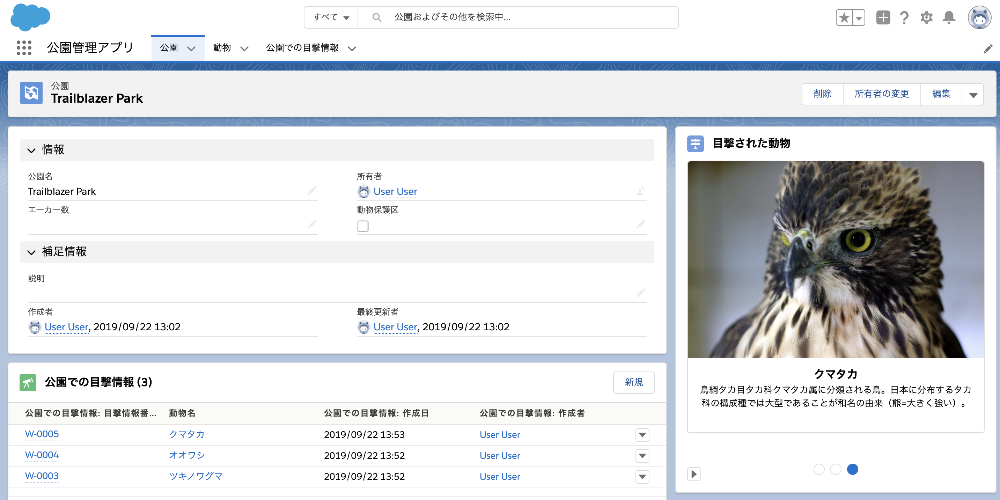

# Minihack Challenge 3 - Salesforce World Tour Tokyo 2019
分かりやすさを優先するため、スクラッチ組織の言語や各種メタデータは日本語ベースで設定しています。



## 解答例の確認方法

### 1. スクラッチ組織を作成する
```
sfdx force:org:create -s -f config/project-scratch-def.json -a swtt2019-c3-park
```

### 2. このフォルダのソースをPushする
```
sfdx force:source:push
```

### 3. 権限セットを割り当てる
```
sfdx force:user:permset:assign -n Park_Manager
```

### 4. サンプルデータをインポートする
```
sfdx force:data:tree:import --plan data/sample-data.json
```

### 5. ブラウザで組織を開く
```
sfdx force:org:open
```

* 任意の公園レコードを開き、右サイドバーにカルーセルが表示されていることを確認します。
* 任意の動物レコードの`絶滅危惧種` 項目にチェックを入れた後、任意の公園レコードに対して、目撃情報レコードを追加します。その公園レコードの `動物保護区` 項目にチェックが入っていることを確認します。