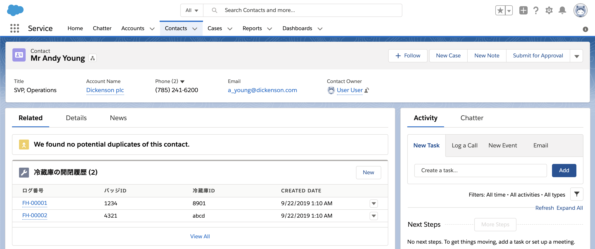

# Minihack Challenge 4 - Salesforce World Tour Tokyo 2019
分かりやすさを優先するため、各種メタデータの表示ラベルは日本語をベースに設定していますが、この課題では、名前を名・姓の順序で扱うため、スクラッチ組織定義ファイルでは、組織の言語やロケールはデフォルト(英語) のままにしています。



## 解答例の確認方法

### 1. スクラッチ組織を作成する
```
sfdx force:org:create -s -f config/project-scratch-def.json -a swtt2019-c4-fridge
```

### 2. このフォルダのソースを Push する
```
sfdx force:source:push
```

### 3. 権限セットを割り当てる
```
sfdx force:user:permset:assign -n Fridge
```

※https://tdx-fridge-logs.herokuapp.com はスクラッチ組織や Sandbox 組織に対応していません。
以下は、手順1〜3で作成した組織で、プラットフォームイベントの受信をテストするための簡易的な手順です。
Developer Edition 組織で https://tdx-fridge-logs.herokuapp.com/ を試す場合は、任意の初期データの名前(例 Andy Young 等) でイベントがPublish されますので、作成されるカスタムオブジェクトレコードから取引先責任者を辿ってください。

### 4. ブラウザで組織を開く
```
sfdx force:org:open
```

* 取引先責任者レコード (例: Andy Young) を開き、冷蔵庫の開閉履歴レコードがないことを確認します。

### 5. サンプルのプラットフォームイベントを Publish する
```
sfdx force:apex:execute -f anonymous.txt
```

* 再度、取引先責任者レコード (例: Andy Young) を開き、冷蔵庫の開閉履歴レコードが登録されていることを確認します。