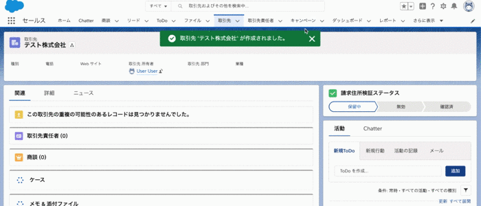

# Minihack Challenge 5 - Salesforce World Tour Tokyo 2019



## 解答例の確認方法
### 1. スクラッチ組織を作成する
```
sfdx force:org:create -s -f config/project-scratch-def.json -a swtt2019-c5-billing
```

### 2. ソースをプッシュする
```
sfdx force:source:push
```

### 3. 権限セットを割り当てる
```
sfdx force:user:permset:assign -n BillingAddressVerificationStatus
```

### 3. 組織を開く
```
sfdx force:org:open
```

### 4. 取引先レコードを新規作成する
* `請求住所検証ステータス` 項目のデフォルト値は `保留中 (Pending) `ですが、少し待ってからステータスが自動的に `無効 (Invalid)` に変わることを確認します。